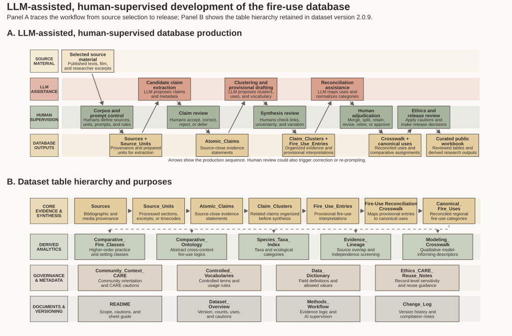

## Project Overview

This project transforms information from ethnographic literature on Indigenous fire practices in northern Alberta into a structured, traceable dataset designed to inform ecological modeling while preserving links to source evidence and context.

## My Role

Dr. Matthew Walls selected the source material for the project and helped lay out the initial workbook structure. I then processed those sources through the dataset-production workflow and developed, expanded, and revised the dataset across all of its versions.

My work included:

- Processing the selected ethnographic sources through the structured extraction workflow
- Reviewing and organizing source material into source units
- Extracting, correcting, and validating atomic claims
- Organizing related claims into claim clusters and provisional fire-use entries
- Reconciling related provisional entries into canonical fire uses
- Expanding and refining relationships among the workbook's tables
- Developing and applying stable identifiers and controlled vocabularies
- Connecting canonical fire uses with comparative classes, ontology terms, evidence lineages, and model-facing fields
- Conducting data cleaning, link validation, consistency checking, and quality assurance
- Creating static and interactive visualizations in R

Throughout the creation and revision of the dataset, I used LLM assistance for structured rereading, candidate claim extraction, clustering, reconciliation, terminology normalization, and drafting. I reviewed, corrected, and validated the resulting records and determined how the extracted evidence was organized and linked within the dataset. The LLM was used as a research tool and was not treated as a source of evidence.

## Dataset Structure

The dataset is organized as an Excel workbook with linked tables. Stable identifiers connect canonical fire uses to their supporting evidence, comparative categories, and model-facing descriptors, allowing readers to trace the connections between source material and the resulting records.

Version 2.0.9 contains 1,442 atomic claims, 311 claim clusters, 171 provisional fire-use entries, and 51 canonical fire uses across its linked tables.

## Research Workflow and Workbook Structure

This figure summarizes the LLM-assisted workflow I used to create and refine the dataset across its versions. It also shows the organization and purpose of the tables in the current Version 2.0.9 workbook.

::: {.column-screen-inset}

[{.static-preview .research-figure-preview fig-alt="Two-panel diagram showing the human-supervised and LLM-assisted dataset development workflow and the Version 2.0.9 workbook structure"}](images/figures/fire-database-workflow.svg){target="_blank"}

:::

::: {.figure-note}

**Dataset:** Fire-use database Version 2.0.9, developed by Matthew Walls and Nicholas Giardina. **Figure:** Nicholas Giardina.

:::

::: {.portfolio-actions}

[Open full-size figure](images/figures/fire-database-workflow.svg){.btn .btn-primary target="_blank"}

[Download PDF](files/figures/fire-database-workflow.pdf){.btn .btn-outline-secondary target="_blank"}

:::

**My Role:** I created this figure in R to document the workflow I used to develop the dataset and explain the relationships among its tables.

**Skills Demonstrated:** Workflow documentation, research data structuring, evidence traceability, and R-based technical visualization.

---

## Model-Facing Data Architecture

The Modeling Crosswalk organizes 51 canonical fire uses into qualitative descriptors that can inform comparative research and ecological modeling. This figure groups those descriptors into practice, space and time, expected fire behaviour, ecological response, and evidence and reuse. It also shows the accompanying guidance about modeling roles, confidence, and limitations.

::: {.column-screen-inset}

[{.static-preview .research-figure-preview fig-alt="Diagram showing how 51 canonical fire uses connect through the Modeling Crosswalk to model-use guidance"}](images/figures/model-facing-architecture.svg){target="_blank"}

:::

::: {.figure-note}

**Source:** Fire-use database Version 2.0.9. **Figure:** Nicholas Giardina.

:::

::: {.portfolio-actions}

[Open full-size figure](images/figures/model-facing-architecture.svg){.btn .btn-primary target="_blank"}

[Download PDF](files/figures/model-facing-architecture.pdf){.btn .btn-outline-secondary target="_blank"}

:::

**My Role:** I organized and reviewed the model-facing fields and created this figure in R to explain how canonical fire uses connect to qualitative descriptors and guidance for their use in modeling.

**Skills Demonstrated:** Qualitative data organization, preparation of model-facing variables, data validation, technical documentation, and R-based visualization.

---

## Worked Crosswalk Example

This worked example shows how CFU-007, Moose-browse and hunting-site burning, is represented in the Modeling Crosswalk. It brings together source support, evidence strength, qualitative descriptors, and modeling limitations. The record is supported by five sources, six source units, and 47 linked claims.

::: {.column-screen-inset}

[{.static-preview .research-figure-preview fig-alt="Worked example showing how CFU-007 Moose-browse and hunting-site burning is represented using model-facing descriptors"}](images/figures/model-facing-example.svg){target="_blank"}

:::

::: {.figure-note}

**Record:** CFU-007, Moose-browse and hunting-site burning. **Source:** Fire-use database Version 2.0.9. **Figure:** Nicholas Giardina.

:::

::: {.portfolio-actions}

[Open full-size figure](images/figures/model-facing-example.svg){.btn .btn-primary target="_blank"}

[Download PDF](files/figures/model-facing-example.pdf){.btn .btn-outline-secondary target="_blank"}

:::

**My Role:** I created this figure in R using the selected record and its linked evidence to illustrate how the Modeling Crosswalk is organized.

**Skills Demonstrated:** Evidence traceability, qualitative data presentation, research communication, and R-based visualization.

## Research and Data Challenges

The project draws on a limited set of ethnographic sources, many of which report interviews and observations. The same interview, statement, or earlier account may appear in more than one source, so multiple references do not necessarily represent independent evidence.

I retained source links and documented shared evidence lineages where they could be identified so that overlapping evidence could be reviewed.

A further challenge was organizing narrative descriptions into consistent categories while preserving differences in context, timing, and spatial form. The dataset retains source references, contextual information, and uncertainty notes alongside its standardized fields. An unreported practice should not automatically be treated as a practice that did not occur.

The dataset is intended as a research and interpretive resource and should not be treated as operational burning guidance, community authorization, or a complete representation of Indigenous knowledge.

## Skills Demonstrated

- Ethnographic evidence extraction and review
- Research data structuring
- Evidence traceability and provenance documentation
- Controlled vocabularies and stable identifiers
- Data cleaning and validation of LLM-assisted outputs
- Preparation of qualitative model-facing variables
- Static and interactive visualization in R
- Technical documentation and research communication